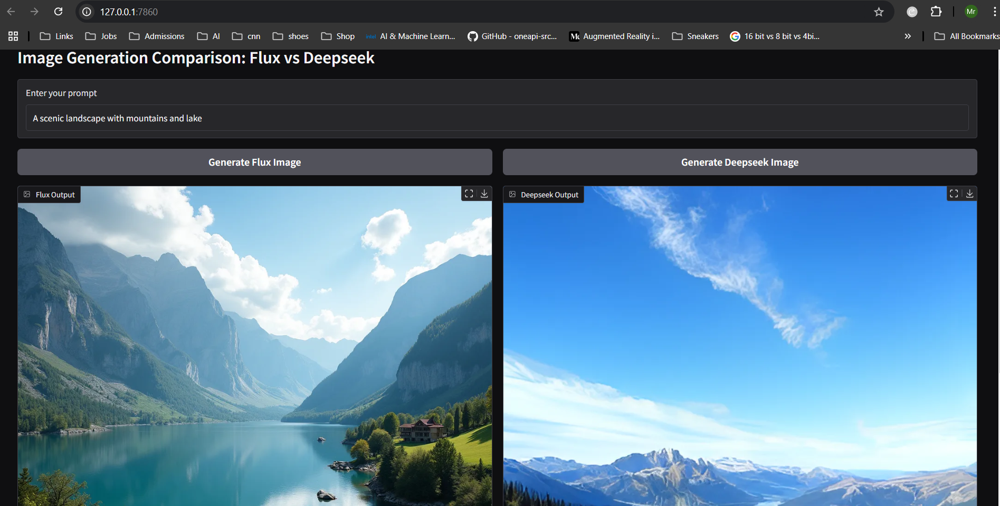
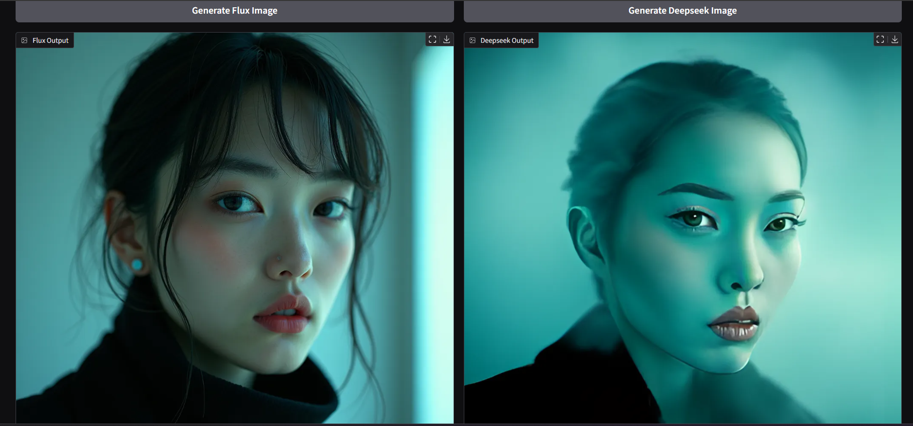
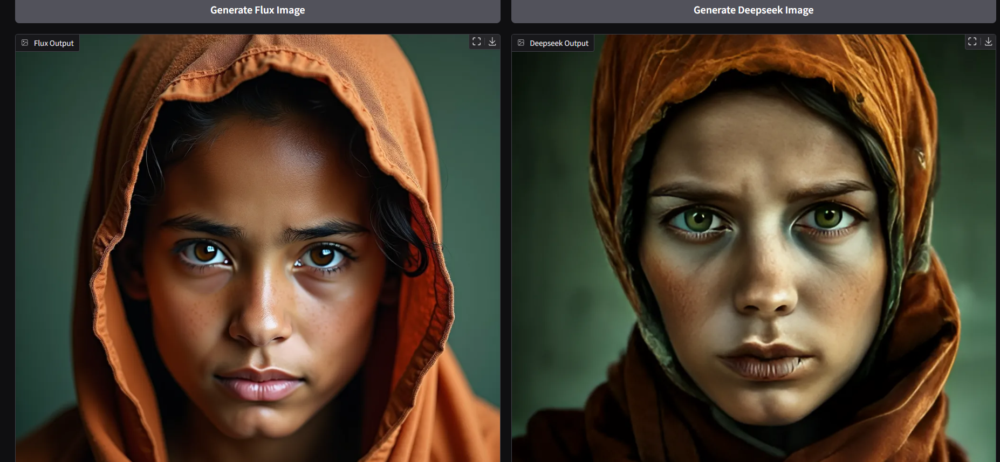
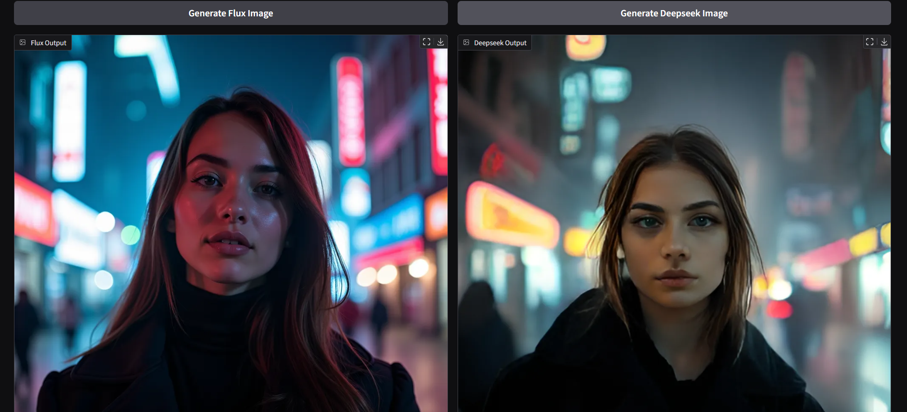
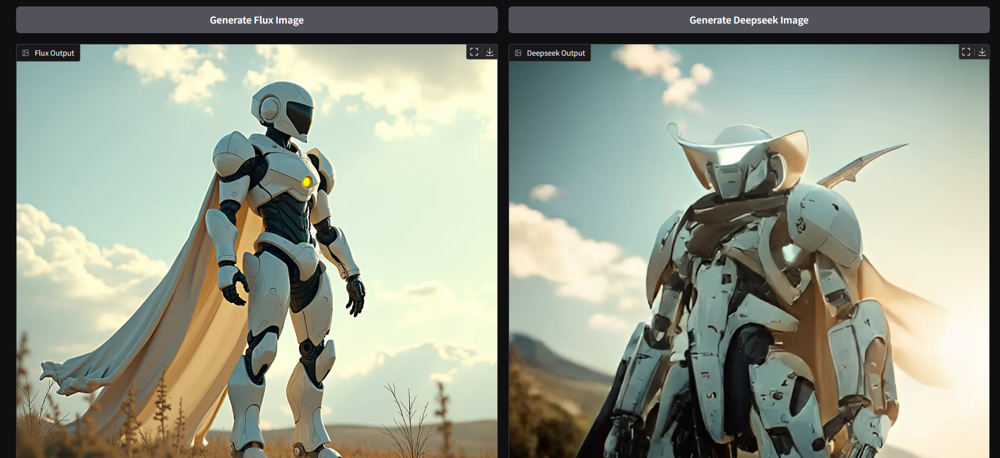
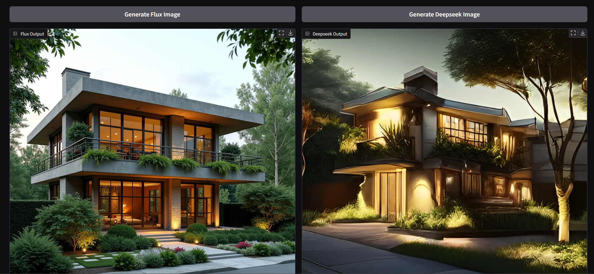

# flux-vs-janus

# Flux 1dev vs Janus Pro 7b: Gradio Tool Comparison

## Summary

This tool allows you to compare the performance of two image generation models: **Flux 1dev** and **Janus Pro 7b**. Based on extensive tests, Flux 1dev significantly outperforms Janus Pro 7b in every aspect, including image quality and generation time.

### Key Points:
- **Flux 1dev** produces much better and clearer photos compared to **Janus Pro 7b**.
- Average generation time for **Flux 1dev** is between **77-81 seconds**.
- Average generation time for **Janus Pro 7b** is between **55-57 seconds**.

## Samples

### Sample 1: Scenic Landscape with Mountains and Lake

Prompt:
```plaintext
A scenic landscape with mountains and lake, vibrant colors, clear sky, serene atmosphere, reflection of mountains in the calm water, lush greenery surrounding the lake, high resolution, hyper-realistic details, 8K quality.
```



### Sample 2: Hyperpop Aesthetic Portrait

Prompt:
```plaintext
(Portrait by Takashi Kijima and Lisa Barnard:1.2), award winning, Barioth, (aesthetic of hyperpop art with rippling atmosphere:0.5), fog, total clarity, f/1.4, symmetry and balance, avant-garde sublime opus magnum with splendid details, (salmon and phthalo turquoise colors:0.1), (Faye Wray:1.3), 100mm f/2.8 macro lens, highly detailed, by Jocelyn Hobbie and Charles Dwyer, Triadic color guide, Leica Q2 with Summilux 28mm f/1.7 ASPH, clear face, Ultra High Resolution, wallpaper, 8K, Rich texture details, hyper detailed, detailed eyes, detailed background, dramatic angle, epic composition, SimplepositiveXLv1 (masterpiece, high quality), solo, model photoshoot, (black theme:1.1), a stylish girl
```



### Sample 3: Intense Portrait of a Young Woman

Prompt:
```plaintext
An emotionally impactful portrait of a young woman with striking, piercing eyes that convey a deep sense of intensity and life experience. She wears a weathered, rust-colored headscarf that frames her face, with subtle imperfections in the fabric adding a sense of realism and history. The background is a muted green, which contrasts with the warmth of her clothing and enhances the vividness of her gaze. The lighting should be natural and soft, emphasizing the texture of her skin and the raw emotion in her expression, creating an image that tells a story of resilience and strength.
```



### Sample 4: City Street, Neon, and Fog

Prompt:
```plaintext
city street, neon, fog, volumetric, closeup portrait photo of young woman in dark clothes
```



### Sample 5: Mecha Robot Design

Prompt:
```plaintext
cgmech, (realistic), solo, white mecha robot, cape, science fiction, torn clothes, glowing, standing, robot joints, mecha, armor, cowboy shot, (floating cape), intense sunlight, silver dragonborn, outdoors, landscape, nature, ((masterpiece, best quality)), <lora:cgmechmix_offset:1><lora:more_details:0.3> <lora:Niji:0.5><lora:dragonborn_offset:0.7>, volumetrics dtx, (film grain, blurry background, blurry foreground, bokeh, depth of field, motion blur:1.3)
```



### Sample 6: Cute Cat with Fireworks

Prompt:
```plaintext
A cute cat, watching some fireworks with an over the top shocked facial expression, holding a sign it says "Buzz If You Love Cats!", realistic, cinematic shot, head tilted back, large eyes, pointing at the viewer, winter.
```


### Sample 7: Modern Street-Facing House

Prompt:
```plaintext
A modern street-facing house seamlessly integrates natural elements into its design. The architecture embodies an urban oasis concept, featuring a balcony adorned with lush greenery and a front yard that blends nature with the urban environment. Soft ambient lighting casts a warm and welcoming glow. Channeling the spirit of renowned architect Frank Lloyd Wright, this design showcases his signature organic architecture style. The medium for this artwork is an architectural blueprint rendered in high-definition 3D graphics, emphasizing every detail of the design. The color scheme primarily consists of earthy tones and various shades of green, enhancing the connection to nature.
```



## Steps to Run

To use this tool locally, follow these steps:

1. Clone the repository to your local machine.
   ```bash
   git clone https://github.com/yourusername/flux-vs-janus
   cd flux-vs-janus
   ```

2. Install required dependencies.
   ```bash
   pip install -r requirements.txt
   ```

3. You can either:
   - Open a **Google Colab** notebook and run the script there.
   - Or, run the **Gradio app** locally:
     ```bash
     python app.py
     ```

### Note:
- The first time you run the app, it may take some time to download the models. Please be patient as this is necessary for the generation process.

Enjoy the comparison and explore the capabilities of Flux 1dev and Janus Pro 7b! Feel free to experiment with different prompts and share your results.

